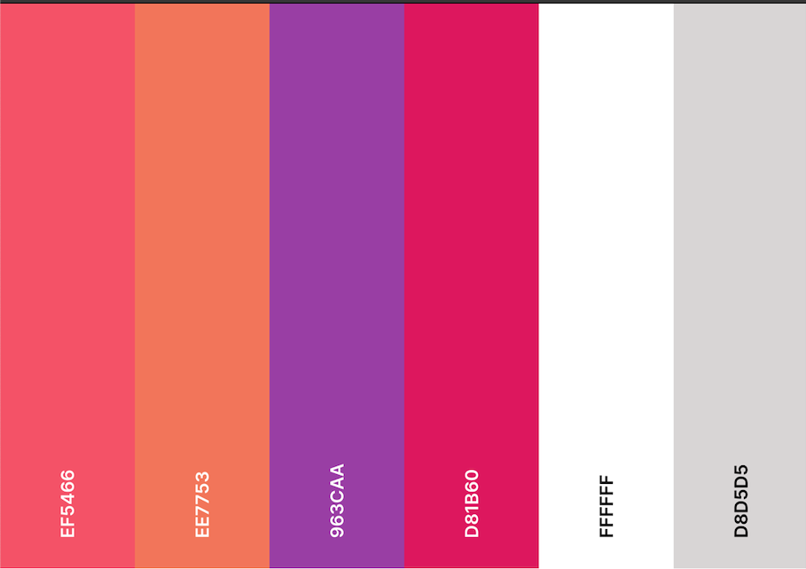
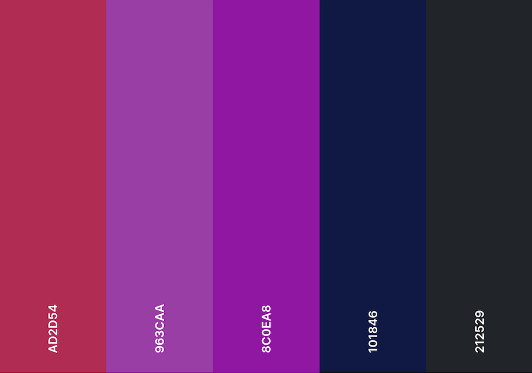
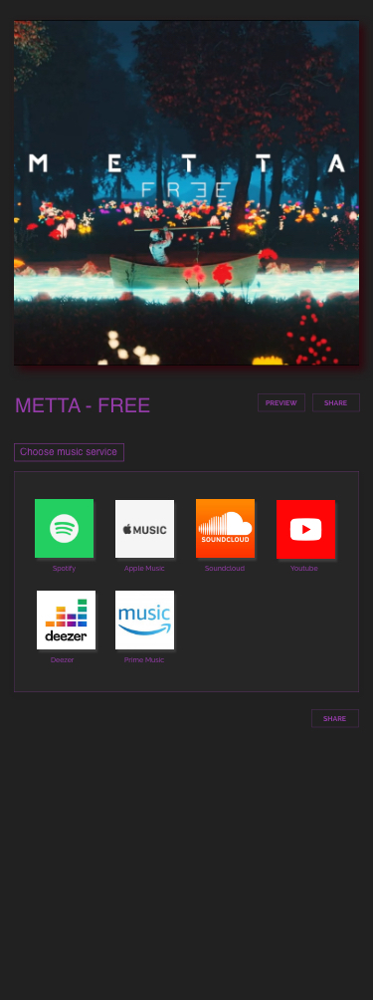
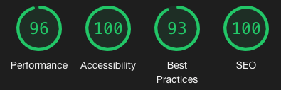
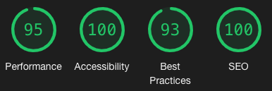
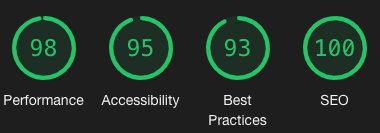
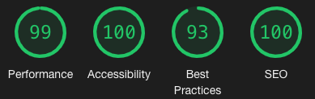

<h1 align="center">METTA</h1>
<h1 align="center"></h1>
<h1 align="center"></h1>


 <a href="https://dadevfa.github.io/Milestone2">Live website</a>

  <a href="https://github.com/dadevfa/Milestone2">GitHub Repository</a>

## About

A modern website for an artist with themes changing depending on the time of the day.
Focus on making the songs of the artist easy to find with a few clicks, 
and at the same time being visually pleasing.


## Table of contents: 
* [General](#general)
* [Technologies](#technologies)
* [UX](#ux)
* [Design](#design)
* [Testing](#testing)
* [Deployment](#deployment)
* [Credits](#credits)

# General
This project is a modern website for an artist with the main focus on driving traffic
to music streaming services where their songs or albums are availabe.


# Technologies

## Languages: 

* HTML5
* CSS3
* Javascript

## Programs, Frameworks & Libraries:

* Adobe Xd - Create Wireframe & design the website.
* Adobe Photoshop - Crop images & logo. 
* Git - Version Control & track changes in code.
* GitHub - Host all files and publishes live site. 
* Gitpod - Code enviroment, allows code to pe pushed to Github.
* Google Fonts - Fonts.
* Adobe Typekit - Fonts.
* Bootstrap v4.1.3 - For responsive layout & collapse functions.
* jQuery - Used for navigation bar.
* Font Awesome - Complements the design.  


# UX

### User Experience

## As a new visitor who comes straight from any social media profile of the artist and has not heard any music yet:

1. I want to find the artists music. 

2. I want to understand the layout and reason for the sites functions without having to focus too much.

3. I want to be able hear a sample of any song before I go to another platform to stream the full song.

## As a visitor who comes from an ad campaign for a specific song: 

1. I want to be able to see that I landed on the right song.

2. I want to understand the layout and reason for the sites functions without having to focus too much.

3. I want to be able to find my streaming platform, to play the song from there. 

## As a visitor who really likes the artist: 

1. I want to be able to connect with the artist. 

2. I would like to be able to get a notification from the artist when there is something new going on. 

3. I would like the esthetics of the artists website to match the artists sound and brand. 


# Design 


### Fonts: 

For most text:
```
* Main font: Raleway

* Fallback font: Sans-Serif
```

For special text:
```
* Special font: Reross Rectangular  

* Fallback font: Serif
```

### Colors: 
Bright Theme:
<h1 align="center"></h1>
Dark Theme:
<h1 align="center"></h1>

### Mockups

Layout, wireframes and design was made and created all in one in Adobe Xd. 
The live site has the same design, with some improvement on some details. 
Live site has functionality that is not visible on mockups

All:
<h1 align="center"></h1>

Desktop:
<h1 align="center"></h1>

Tablet:
<h1 align="center"></h1>

Phone:
<h1 align="center"></h1>


### Pages: 

## Home:
The homepage contains a gradient hero section that has some animation. 
Big logo, and a call to action sending user to music library. 
A "latest releases" directly under the hero section. 
Followed by a signup for fan letters. 

## Music:
Artists music library. 
All released material will end up here. 

## Contact: 
Simple contact page connected. 
With special font active for extra futuristic look and feeling.

## Free/Everything:
Individual song page. Instead of the standard way of having streaming platforms
lined up, we give the user a more futuristic feeling where they appear as apps. 
Like they would on the users phone. Share functionality added here with a little animation. User can save the URL, send or post on diffrent Social Medias, or forward the song through an email.
Cool animation when hovering the album cover, clicking on it will activate a drop down 
with a preview of the song. Same goes for pressing the preview button.


## Overall:
Theme changes depending what time of the day it is, but only if the user hasn't changed the theme manually in menu.
Navigation bar is behaving just as the hero section, and the menu background does the same.
With some nice animation added when pressing the hamburger. Pressing the DarkMode/BrightMode button
in menu, will change the background imidiately, so the user understands that the change is in place. 
Footer contains all important social media links, with buttons, to go to top
or to important pages. 


## Future features: 
- Users emailaddresses should be sent to a database, and not to an emailaddress through email.js. 
- A follow functionality for all social medias. 
- Build an admin dashboard for the artist or manager for them to upload new releases with all
links to streming services, add new services, album covers, titles and it will appear thereafter. 
- Build a game on the site that matches the brand. Rockets and planets? The winner will recieve tickets to shows or products. 

# Testing 

## Tests on live version: 

### Navigation Bar/Menu: 
- Looks good on all devices. 
- Works on all browsers.
- Works on all pages.
- All links in menu works correctly. 
- The Theme Switch button works. 

### Home: 
- Looks good on all devices, and browsers.
- Callout button works perfectly.
- Latest releases has correct links.
- Signing up for fanmails sends email to correct emailaddress. Button changes from Submit to Sent. Pressing terms collapses into the terms, and the button changes to "Close terms".
The terms do look bigger than intended for one second when collapsing, don't know what causes this. 
- Google thinks the font color for darkmode does not have the best contrast. Changing this would alter the design. Will try slightly brighter color.
- All CSS and jQuery Hover effects work.

### Music: 
- Looks good on all devices, and all browsers. 
- User can see the diffrent released content in a minimalistic way. 
- Hover effects work.

### Contact: 
- Works fine. 
- Need a popup or animation to let user know it was successfully sent. 
- Erases input fields when sent.

### Free: 
- Looks good on all devices, all browsers. 
- Sometimes issues regarding third party cookies appear for the embedded preview from spotify. 
in the console. Not much to do about that. 
- Preview works when pressing artwork, and the preview button. Smooth scroll on desktops for the button.
- Share functionality works, on all devices and browsers. 
- All links go to the correct platforms. 
- All hover effects are working. 

### Everything: 
- Looks good on all devices, all browsers. 
- Sometimes issues regarding third party cookies appear for the embedded preview from spotify. 
in the console. Not much to do about that. 
- Preview works when pressing artwork, and the preview button. Smooth scroll on desktops for the button.
- Share functionality works, on all devices and browsers. 
- All links go to the correct platforms. 
- All hover effects are working. 

### Footer:
- Works and looks good on all devices. 
- Works on all browsers. 
- All links are correct.
- Works on all pages. 
- All hover effects are working. 


### Physical Test Devices:
* iPhone 5 SE 
* iPhone 6 
* iPhone 7 
* iPhone X 
* Samsung Galaxy 9 
* Macbook Pro 13
* iPad 

### Chrome Devtools Test Devices:
* All iPhones
* Samsung Galaxy s5
* Moto G4
* Pixel 2 and 2XL
* Surface Duo 
* Ipad & Ipad Pro
* Responsive mode

### Test Browsers:
* Chrome
* Safari 
* Firefox 
* Opera 

## Lighthouse Results: 

### Home:


### Music:


### Free:


### Everything:


### Contact:



### HTML Validation Results: 

<a href="https://validator.w3.org/nu/?doc=https%3A%2F%2Fdadevfa.github.io%2FMilestone2%2Findex.html#l906c1">Home - Pass</a>

<a href="https://validator.w3.org/nu/?doc=https%3A%2F%2Fdadevfa.github.io%2FMilestone2%2Fmusic.html#l906c1">Music - Pass</a>

<a href="https://validator.w3.org/nu/?doc=https%3A%2F%2Fdadevfa.github.io%2FMilestone2%2Ffree.html#l906c1">Free - Pass</a>

<a href="https://validator.w3.org/nu/?doc=https%3A%2F%2Fdadevfa.github.io%2FMilestone2%2Feverything.html#l906c1">Everything - Pass</a>

<a href="https://validator.w3.org/nu/?doc=https%3A%2F%2Fdadevfa.github.io%2FMilestone2%2Fcontact.html#l906c1">Contact - Pass</a>


### CSS Validation Results:
#### <a href="https://jigsaw.w3.org/css-validator/validator#css">CSS Bright - Pass</a>
#### <a href="https://jigsaw.w3.org/css-validator/validator#css">CSS Dark - Pass</a>

### JSHint Check: 
Some warnings, no errors. 

## Known issues: 
- Does not adapt well to Galaxy Fold. 
- Third party warnings regarding embedded content in console. 
- Fonticon missing. 
- "Go back to music" button, makes content around it move on hover on few screens.


## Tested by other people: 
"
It's easy to find the artists music. Both through the first button on when you come on the homepage.
But also by scrolling down under latest releases. Also through menu and at the bottom of the page.

It's not crowded with content so it's easy to navigate and understand.

Could listen to a little bit of both songs which is good for I have never heard anything. 
I went to youtube and played the full song by clicking on the Youtube logo.
I also subsribed on METTAs channel. 

I think that the websites profiling or design matches the artists music. Very nice!
"
# Deployment

This website was published using GitHub Pages. 

On Github, and on the specific repository for this page, there is a settings button.
Further down on that page is Github Pages section. 
I selected the Master branch instead of None and saved it. Site went live.
The link was made using the repository name as a part of it. 


# Credits
* Ian Lunn for great hover effects: https://github.com/IanLunn/Hover 
* Sergiu Șandor for the tilt.js effects, original idea: https://github.com/gijsroge/tilt.js
* Stackoverflow community. 
* Dev Ed for inspiration Tilt.js
* Julio Codes for inspiration on gradient animation: https://www.youtube.com/watch?v=fBRzD6dwJfw 
* Code Institute for the start template with presets and plugins in Gitpod. 
* Toolur for compressing images.  